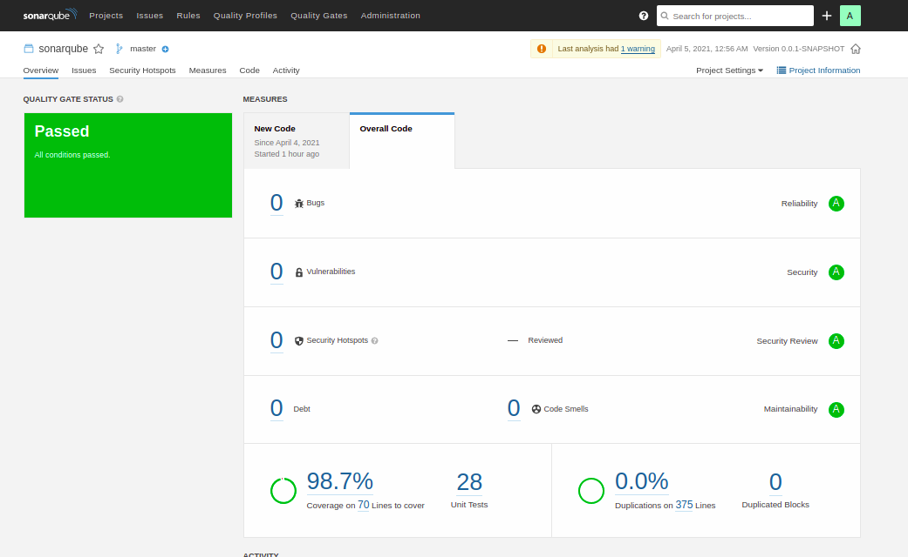
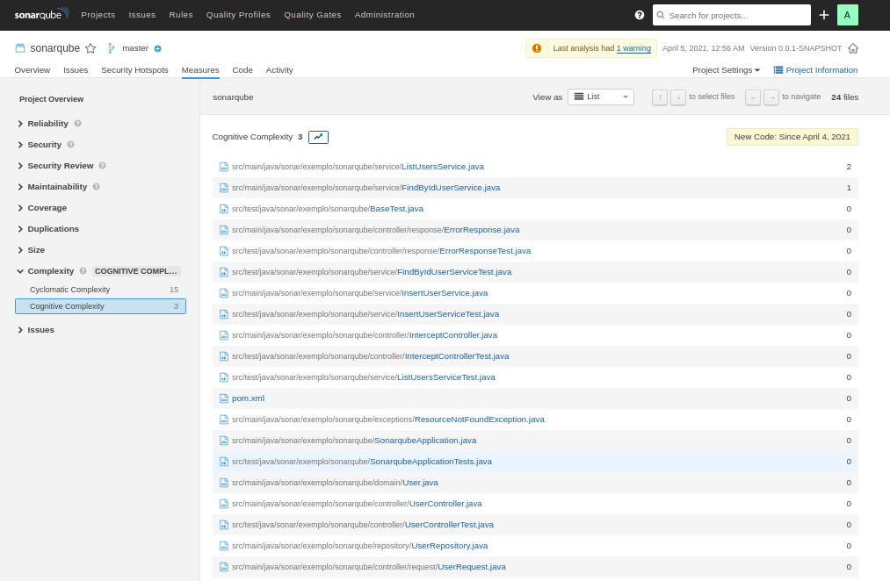

# Exemplo Simples de Arquitetura para projetos Spring Boot

Criei esse exemplo simples para mostrar como fica orgaizado os meus arquivos em meus projetos Spring.

Para rodar o projeto é necessário ter instalado:

* Maven 3.6+
* JDK 15+

Subir o projeto
===

Rode na pasta raiz os comandos:
~~~
mvn clean install
mvn spring-boot:run
~~~

Para acessar a documentação do projeto acesse:

~~~
localhost:8080/swagger-ui.html
~~~

Qualidade de código do projeto
---

Complexidade do código
----

